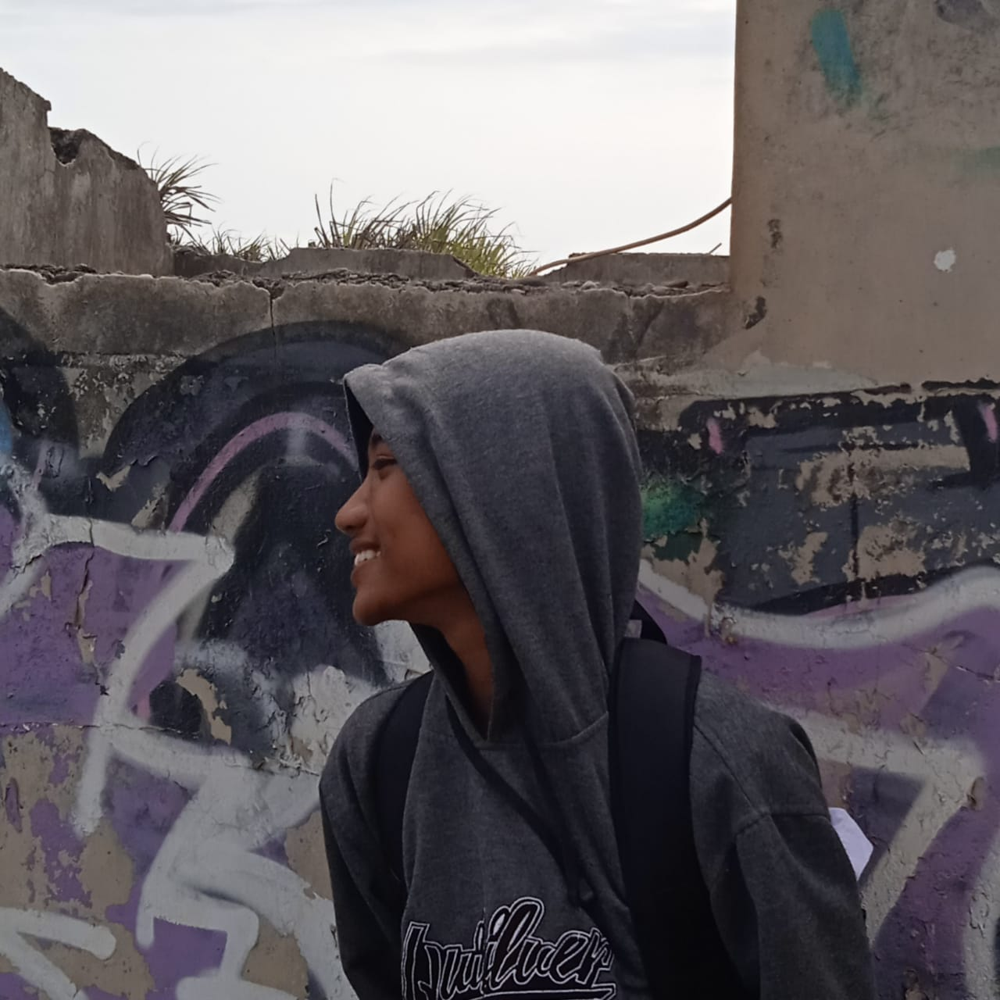

<!DOCTYPE html>
<html lang="id">
<head>
  <meta charset="utf-8">
  <meta name="viewport" content="width=device-width, initial-scale=1">
  <title>Biodata Saya - Abi Lutdfiansyah Said</title>
  
</head>
<body>
  

    <a href="#beranda">Beranda</a>
    <a href="#biodata">Biodata</a>
    <a href="#proyek">Proyek</a>
  

  <section id="beranda" class="beranda">
    

      <h1>Selamat Datang!</h1>
      
Halo, saya <strong>Abi Lutdfiansyah Said</strong>, seorang pelajar yang tertarik pada dunia pengembangan web dan pemrograman. Yuk kenali saya lebih lanjut!

    

  </section>

  <section id="biodata">
    

      

        <h1>BIODATA DIRI</h1>
      

      

        <h2>Informasi</h2>
        

          
        

        <table>
          <tr><th>Nama</th><th>:</th><td>Abi Lutdfiansyah Said</td></tr>
          <tr><th>Tempat</th><th>:</th><td>Sulang lor</td></tr>
          <tr><th>Tgl. Lahir</th><th>:</th><td>23 April 2009</td></tr>
          <tr><th>Agama</th><th>:</th><td>Islam</td></tr>
          <tr><th>Alamat</th><th>:</th><td>Sulang lor, Patalan, Jetis, Bantul</td></tr>
          <tr><th>Email</th><th>:</th><td>lutdfiansyahsaidabi@gmail.com</td></tr>
          <tr><th>No. HP</th><th>:</th><td>088216040747</td></tr>
          <tr><th>Website</th><th>:</th><td><a href="https://abi121318.github.io/World/" target="_blank">https://abi121318.github.io/World/</a></td></tr>
        </table>
      

      

        <h2>Pendidikan</h2>
        <ul>
          <li><b>2015 - 2021</b> SD 1 Negeri Patalan</li>
          <li><b>2021 - 2024</b> SMP 3 Negeri Jetis</li>
          <li><b>2024 - 2027</b> SMK 1 Negeri Sanden</li>
        </ul>
      

      

        <h2>Pengalaman Kerja</h2>
        <ul>
          <li><b>2024 - 2027</b> - <i>Back-End Developer</i> di SMK N 1 Sanden</li>
        </ul>
      

      

        <h2>Keahlian</h2>
        <ul>
          <li>HTML</li>
          <li>CSS</li>
          <li>JavaScript</li>
          <li>PHP</li>
          <li>CodeIgniter</li>
          <li>Laravel</li>
          <li>NodeJS</li>
        </ul>
      

    

  </section>

  <section id="proyek" class="proyek">
    

      <h2>Proyek Saya</h2>
      <ul>
        <li><strong>Website Portofolio</strong> - Menampilkan biodata dan keahlian saya dengan HTML dan CSS.</li>
        <li><strong>CRUD Siswa</strong> - Aplikasi CRUD berbasis PHP & MySQL menggunakan CodeIgniter.</li>
        <li><strong>Website Artikel</strong> - Platform sederhana untuk menulis dan mengelola artikel dengan Laravel.</li>
        <li><strong>API Backend</strong> - Membangun RESTful API menggunakan NodeJS dan Express.</li>
      </ul>
    

  </section>
</body>
</html>
